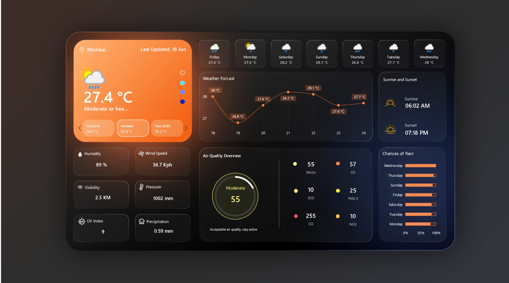

# Weather Dashboard – Power BI Project

📊 This is a real-time weather analytics dashboard built using Power BI, integrating live weather data (e.g., Temperature, AQI, Forecasts, Wind, Humidity).  
It uses WeatherAPI and dynamic M-queries for live data, and includes interactive cards & filters.

### 🔧 Features
- Real-time weather insights
- AQI display
- Location-based filtering
- Clean, modern UI

### 📁 Files
- Weather Dashboard.pbix – main Power BI report
- M Queries & API configs
- Icons & resources

### 📌 Notes
Built for learning data visualization and portfolio showcasing.
## Screenshots

  
